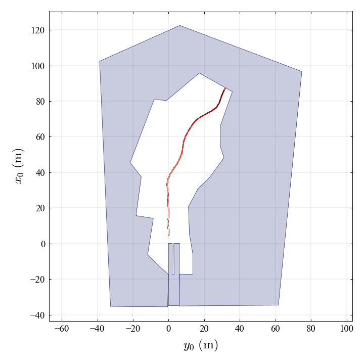
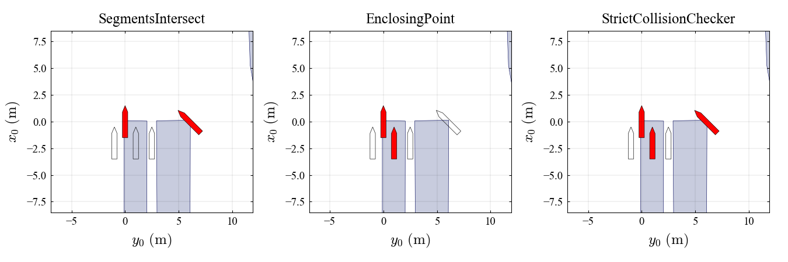

# mmg-1p1r-simulator
Simulation code for MMG model of single propeller single rudder ship

## Citation

If you use the code for a scientific publication, we would appreciate references to the following papers:

- MMG model
   - **Miyauchi, Y., Maki, A., Umeda, N., Rachman, D. M., & Akimoto, Y. (2022). System parameter exploration of ship maneuvering model for automatic docking/berthing using CMA-ES. *Journal of Marine Science and Technology*, *27*(2), 1065–1083. https://doi.org/10.1007/s00773-022-00889-3**
- Wind Generation Model 
   - **Maki, A., Maruyama, Y., Dostal, L. et al. Practical method for evaluating wind influence on autonomous ship operations. J Mar Sci Technol 27, 1302–1313 (2022). https://doi.org/10.1007/s00773-022-00901-w**
   - **Maki, A., Maruyama, Y., Dostal, L. et al. Practical method for evaluating wind influence on autonomous ship operations (2nd report). J Mar Sci Technol 29, 876–884 (2024). https://doi.org/10.1007/s00773-024-01025-z**
- Simulator
   - **Sawada R. et al. Perspective on the Marine Simulator for Autonomous Vessel Development (To be submitted)**

## Demo

##### Simulation Result of Esso Osaka in Inukai pond (Done by [tutorial_simulation.ipynb](tutorial_simulation.ipynb))

##### Collision detection test in Inukai pond (Done by [tutorial_collision.ipynb](tutorial_collision.ipynb))

## License

The dataset is released under the [Creative Commons BY-NC 4.0 License](https://creativecommons.org/licenses/by-nc/4.0/).

